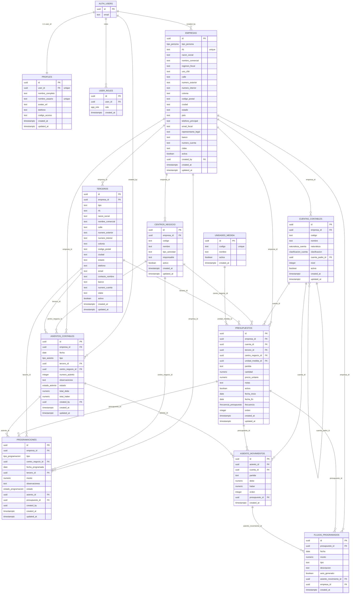

# Documentación de infraestructura no versionada — Uniline / Maq Rentable

Backend: Lovable Cloud (Supabase / PostgreSQL 15 + PostgREST + GoTrue).
Fecha del inventario: 2026-08-07.
Alcance: todo lo que **no** vive en el repositorio (esquema de base de datos, lógica en BD, RLS, secrets, edge functions, storage, datos de muestra).

---

## 1. Esquema completo de la base de datos

### 1.1 Schemas existentes

| Schema | Origen | Contenido |
|---|---|---|
| `public` | Aplicación | 12 tablas de negocio |
| `auth` | Supabase GoTrue (gestionado) | `users`, `sessions`, `identities`, `refresh_tokens`, `mfa_*`, `sso_*`, `saml_*`, `flow_state`, `one_time_tokens`, `instances`, `audit_log_entries`, `schema_migrations` |
| `storage` | Supabase Storage (gestionado) | `buckets`, `objects` |
| `extensions` | Extensiones | `pg_stat_statements`, `pg_stat_statements_info` |
| `vault` | Supabase Vault 0.3.1 | secretos cifrados internos |

Extensiones instaladas: `plpgsql 1.0` (pg_catalog), `pgcrypto 1.3` (extensions), `uuid-ossp 1.1` (extensions), `pg_stat_statements 1.11` (extensions), `supabase_vault 0.3.1` (vault).
**No existe el schema `cron`** → no hay `pg_cron` instalado.

Secuencias en `public`: `asientos_contables_numero_asiento_seq` (último valor 2115). No hay columnas `IDENTITY` ni columnas generadas (`GENERATED`) en ninguna tabla; todos los PK son `uuid DEFAULT gen_random_uuid()`.

---

### 1.2 Tablas del schema `public`

Convención en las tablas: **PK** = llave primaria, **FK** = llave foránea, **U** = unique.

#### `empresas`
Entidades fiscales (personas morales/físicas) sobre las que se lleva la contabilidad. Raíz del modelo multi-empresa.

| # | Columna | Tipo | Nullable | Default | Claves |
|---|---|---|---|---|---|
| 1 | id | uuid | NO | gen_random_uuid() | **PK** |
| 2 | tipo_persona | tipo_persona | NO | — | |
| 3 | rfc | text | NO | — | **U** (`empresas_rfc_key`) |
| 4 | razon_social | text | NO | — | |
| 5 | nombre_comercial | text | SÍ | — | |
| 6 | regimen_fiscal | text | SÍ | — | |
| 7 | uso_cfdi | text | SÍ | — | |
| 8 | calle | text | SÍ | — | |
| 9 | numero_exterior | text | SÍ | — | |
| 10 | numero_interior | text | SÍ | — | |
| 11 | colonia | text | SÍ | — | |
| 12 | codigo_postal | text | SÍ | — | |
| 13 | ciudad | text | SÍ | — | |
| 14 | estado | text | SÍ | — | |
| 15 | pais | text | SÍ | `'México'::text` | |
| 16 | telefono_principal | text | SÍ | — | |
| 17 | email_fiscal | text | SÍ | — | |
| 18 | representante_legal | text | SÍ | — | |
| 19 | banco | text | SÍ | — | |
| 20 | numero_cuenta | text | SÍ | — | |
| 21 | clabe | text | SÍ | — | |
| 22 | activa | boolean | NO | true | |
| 23 | created_by | uuid | SÍ | — | **FK** → `auth.users.id` |
| 24 | created_at | timestamptz | NO | now() | |
| 25 | updated_at | timestamptz | NO | now() | |

#### `centros_negocio`
Centros de negocio / costos / proyectos por empresa.

| # | Columna | Tipo | Nullable | Default | Claves |
|---|---|---|---|---|---|
| 1 | id | uuid | NO | gen_random_uuid() | **PK** |
| 2 | empresa_id | uuid | NO | — | **FK** → `empresas.id` |
| 3 | codigo | text | NO | — | U parcial (ver 3.3) |
| 4 | nombre | text | NO | — | |
| 5 | tipo_actividad | text | SÍ | — | |
| 6 | responsable | text | SÍ | — | |
| 7 | activo | boolean | NO | true | |
| 8 | created_at | timestamptz | NO | now() | |
| 9 | updated_at | timestamptz | NO | now() | |

#### `cuentas_contables`
Catálogo de cuentas jerárquico (formato 12 dígitos `XXX-XXX-XXX-XXX`) por empresa.

| # | Columna | Tipo | Nullable | Default | Claves |
|---|---|---|---|---|---|
| 1 | id | uuid | NO | gen_random_uuid() | **PK** |
| 2 | empresa_id | uuid | NO | — | **FK** → `empresas.id`; U compuesta con `codigo` |
| 3 | codigo | text | NO | — | U compuesta con `empresa_id` |
| 4 | nombre | text | NO | — | |
| 5 | naturaleza | naturaleza_cuenta | NO | — | |
| 6 | clasificacion | clasificacion_cuenta | NO | — | |
| 7 | cuenta_padre_id | uuid | SÍ | — | **FK** → `cuentas_contables.id` (auto-referencia) |
| 8 | nivel | integer | NO | 1 | |
| 9 | activa | boolean | NO | true | |
| 10 | created_at | timestamptz | NO | now() | |
| 11 | updated_at | timestamptz | NO | now() | |

#### `terceros`
Clientes y proveedores por empresa.

| # | Columna | Tipo | Nullable | Default | Claves |
|---|---|---|---|---|---|
| 1 | id | uuid | NO | gen_random_uuid() | **PK** |
| 2 | empresa_id | uuid | NO | — | **FK** → `empresas.id`; U compuesta con `rfc` |
| 3 | tipo | text | NO | — | CHECK: cliente/proveedor/ambos |
| 4 | rfc | text | NO | — | U compuesta con `empresa_id` |
| 5 | razon_social | text | NO | — | |
| 6 | nombre_comercial | text | SÍ | — | |
| 7 | calle | text | SÍ | — | |
| 8 | numero_exterior | text | SÍ | — | |
| 9 | numero_interior | text | SÍ | — | |
| 10 | colonia | text | SÍ | — | |
| 11 | codigo_postal | text | SÍ | — | |
| 12 | ciudad | text | SÍ | — | |
| 13 | estado | text | SÍ | — | |
| 14 | telefono | text | SÍ | — | |
| 15 | email | text | SÍ | — | |
| 16 | contacto_nombre | text | SÍ | — | |
| 17 | banco | text | SÍ | — | |
| 18 | numero_cuenta | text | SÍ | — | |
| 19 | clabe | text | SÍ | — | |
| 20 | activo | boolean | NO | true | |
| 21 | created_at | timestamptz | NO | now() | |
| 22 | updated_at | timestamptz | NO | now() | |

#### `unidades_medida`
Catálogo global (no ligado a empresa) de unidades para partidas presupuestales.

| # | Columna | Tipo | Nullable | Default | Claves |
|---|---|---|---|---|---|
| 1 | id | uuid | NO | gen_random_uuid() | **PK** |
| 2 | codigo | text | NO | — | **U** (`unidades_medida_codigo_key`) |
| 3 | nombre | text | NO | — | |
| 4 | activa | boolean | NO | true | |
| 5 | created_at | timestamptz | NO | now() | |

#### `presupuestos`
Partidas presupuestales por empresa/centro/cuenta/tercero, con cantidad, precio unitario, vigencia y frecuencia.

| # | Columna | Tipo | Nullable | Default | Claves |
|---|---|---|---|---|---|
| 1 | id | uuid | NO | gen_random_uuid() | **PK** |
| 2 | empresa_id | uuid | NO | — | **FK** → `empresas.id` |
| 3 | cuenta_id | uuid | SÍ | — | **FK** → `cuentas_contables.id` |
| 4 | tercero_id | uuid | SÍ | — | **FK** → `terceros.id` |
| 5 | centro_negocio_id | uuid | SÍ | — | **FK** → `centros_negocio.id` |
| 6 | unidad_medida_id | uuid | SÍ | — | **FK** → `unidades_medida.id` |
| 7 | partida | text | NO | — | |
| 8 | cantidad | numeric(15,4) | NO | 1 | |
| 9 | precio_unitario | numeric(15,4) | NO | 0 | |
| 10 | notas | text | SÍ | — | |
| 11 | activo | boolean | NO | true | |
| 12 | created_at | timestamptz | NO | now() | |
| 13 | updated_at | timestamptz | NO | now() | |
| 14 | fecha_inicio | date | SÍ | — | |
| 15 | fecha_fin | date | SÍ | — | |
| 16 | frecuencia | frecuencia_presupuesto | SÍ | `'mensual'` | |
| 17 | orden | integer | SÍ | 0 | orden manual (drag & drop) |

#### `flujos_programados`
Flujos de efectivo programados de una partida presupuestal; también los generados automáticamente por IVA desde asientos aplicados.

| # | Columna | Tipo | Nullable | Default | Claves |
|---|---|---|---|---|---|
| 1 | id | uuid | NO | gen_random_uuid() | **PK** |
| 2 | presupuesto_id | uuid | SÍ | — | **FK** → `presupuestos.id` |
| 3 | fecha | date | NO | — | |
| 4 | monto | numeric | NO | 0 | |
| 5 | tipo | text | NO | — | CHECK: ingreso/egreso |
| 6 | descripcion | text | SÍ | — | |
| 7 | created_at | timestamptz | NO | now() | |
| 8 | auto_generado | boolean | NO | false | true = creado por trigger IVA |
| 9 | asiento_movimiento_id | uuid | SÍ | — | **FK** → `asiento_movimientos.id` |
| 10 | empresa_id | uuid | SÍ | — | **FK** → `empresas.id` |

#### `asientos_contables`
Encabezado de póliza contable (partida doble).

| # | Columna | Tipo | Nullable | Default | Claves |
|---|---|---|---|---|---|
| 1 | id | uuid | NO | gen_random_uuid() | **PK** |
| 2 | empresa_id | uuid | NO | — | **FK** → `empresas.id` |
| 3 | fecha | date | NO | CURRENT_DATE | |
| 4 | tipo | tipo_asiento | NO | `'diario'` | |
| 5 | tercero_id | uuid | SÍ | — | **FK** → `terceros.id` |
| 6 | centro_negocio_id | uuid | SÍ | — | **FK** → `centros_negocio.id` |
| 7 | numero_asiento | integer | NO | `nextval('asientos_contables_numero_asiento_seq')` | folio secuencial global (no unique) |
| 8 | observaciones | text | SÍ | — | |
| 9 | estado | estado_asiento | NO | `'borrador'` | |
| 10 | total_debe | numeric(15,2) | NO | 0 | |
| 11 | total_haber | numeric(15,2) | NO | 0 | |
| 12 | created_by | uuid | SÍ | — | **FK** → `auth.users.id` |
| 13 | created_at | timestamptz | NO | now() | |
| 14 | updated_at | timestamptz | NO | now() | |

#### `asiento_movimientos`
Renglones (cargos/abonos) de cada asiento.

| # | Columna | Tipo | Nullable | Default | Claves |
|---|---|---|---|---|---|
| 1 | id | uuid | NO | gen_random_uuid() | **PK** |
| 2 | asiento_id | uuid | NO | — | **FK** → `asientos_contables.id` |
| 3 | cuenta_id | uuid | NO | — | **FK** → `cuentas_contables.id` |
| 4 | partida | text | NO | — | descripción libre del renglón |
| 5 | debe | numeric(15,2) | NO | 0 | |
| 6 | haber | numeric(15,2) | NO | 0 | |
| 7 | orden | integer | NO | 0 | |
| 8 | created_at | timestamptz | NO | now() | |
| 9 | presupuesto_id | uuid | SÍ | — | **FK** → `presupuestos.id` |

#### `programaciones`
Programación de cobros/pagos (tesorería) enlazada opcionalmente a un presupuesto y al asiento que la ejecutó.

| # | Columna | Tipo | Nullable | Default | Claves |
|---|---|---|---|---|---|
| 1 | id | uuid | NO | gen_random_uuid() | **PK** |
| 2 | empresa_id | uuid | NO | — | **FK** → `empresas.id` |
| 3 | tipo | tipo_programacion | NO | — | |
| 4 | centro_negocio_id | uuid | SÍ | — | **FK** → `centros_negocio.id` |
| 5 | fecha_programada | date | NO | — | |
| 6 | tercero_id | uuid | SÍ | — | **FK** → `terceros.id` |
| 7 | monto | numeric | NO | 0 | |
| 8 | observaciones | text | SÍ | — | |
| 9 | estado | estado_programacion | NO | `'pendiente'` | |
| 10 | asiento_id | uuid | SÍ | — | **FK** → `asientos_contables.id` |
| 11 | created_by | uuid | SÍ | — | sin FK declarada |
| 12 | created_at | timestamptz | NO | now() | |
| 13 | updated_at | timestamptz | NO | now() | |
| 14 | presupuesto_id | uuid | SÍ | — | **FK** → `presupuestos.id` |

#### `profiles`
Perfil de aplicación 1:1 con `auth.users`. Incluye `codigo_acceso` usado para confirmar operaciones sensibles (borrado de asientos).

| # | Columna | Tipo | Nullable | Default | Claves |
|---|---|---|---|---|---|
| 1 | id | uuid | NO | gen_random_uuid() | **PK** |
| 2 | user_id | uuid | NO | — | **FK** → `auth.users.id`; **U** |
| 3 | nombre_completo | text | NO | — | |
| 4 | nombre_usuario | text | NO | — | **U** |
| 5 | avatar_url | text | SÍ | — | |
| 6 | telefono | text | SÍ | — | |
| 7 | created_at | timestamptz | NO | now() | |
| 8 | updated_at | timestamptz | NO | now() | |
| 9 | codigo_acceso | text | SÍ | — | |

#### `user_roles`
Roles de aplicación separados del perfil (anti escalación de privilegios).

| # | Columna | Tipo | Nullable | Default | Claves |
|---|---|---|---|---|---|
| 1 | id | uuid | NO | gen_random_uuid() | **PK** |
| 2 | user_id | uuid | NO | — | **FK** → `auth.users.id`; U compuesta con `role` |
| 3 | role | app_role | NO | `'usuario'` | U compuesta con `user_id` |
| 4 | created_at | timestamptz | NO | now() | |

---

## 2. Relaciones entre tablas

### 2.1 Foreign keys (con acciones)

Todas las FK tienen `ON UPDATE NO ACTION` (no se declaró ninguna acción de update en el proyecto).

| Origen | Destino | ON DELETE | Cardinalidad |
|---|---|---|---|
| `asiento_movimientos.asiento_id` | `asientos_contables.id` | CASCADE | 1:N |
| `asiento_movimientos.cuenta_id` | `cuentas_contables.id` | RESTRICT | 1:N |
| `asiento_movimientos.presupuesto_id` | `presupuestos.id` | SET NULL | 1:N |
| `asientos_contables.empresa_id` | `empresas.id` | CASCADE | 1:N |
| `asientos_contables.tercero_id` | `terceros.id` | SET NULL | 1:N |
| `asientos_contables.centro_negocio_id` | `centros_negocio.id` | SET NULL | 1:N |
| `asientos_contables.created_by` | `auth.users.id` | NO ACTION | 1:N |
| `centros_negocio.empresa_id` | `empresas.id` | CASCADE | 1:N |
| `cuentas_contables.empresa_id` | `empresas.id` | CASCADE | 1:N |
| `cuentas_contables.cuenta_padre_id` | `cuentas_contables.id` | NO ACTION | 1:N (auto-referencia, árbol) |
| `empresas.created_by` | `auth.users.id` | NO ACTION | 1:N |
| `flujos_programados.presupuesto_id` | `presupuestos.id` | CASCADE | 1:N |
| `flujos_programados.asiento_movimiento_id` | `asiento_movimientos.id` | CASCADE | 1:N |
| `flujos_programados.empresa_id` | `empresas.id` | NO ACTION | 1:N |
| `presupuestos.empresa_id` | `empresas.id` | CASCADE | 1:N |
| `presupuestos.cuenta_id` | `cuentas_contables.id` | SET NULL | 1:N |
| `presupuestos.tercero_id` | `terceros.id` | SET NULL | 1:N |
| `presupuestos.centro_negocio_id` | `centros_negocio.id` | SET NULL | 1:N |
| `presupuestos.unidad_medida_id` | `unidades_medida.id` | SET NULL | 1:N |
| `profiles.user_id` | `auth.users.id` | CASCADE | **1:1** (user_id es UNIQUE) |
| `programaciones.empresa_id` | `empresas.id` | NO ACTION | 1:N |
| `programaciones.centro_negocio_id` | `centros_negocio.id` | NO ACTION | 1:N |
| `programaciones.tercero_id` | `terceros.id` | NO ACTION | 1:N |
| `programaciones.asiento_id` | `asientos_contables.id` | NO ACTION | 1:N |
| `programaciones.presupuesto_id` | `presupuestos.id` | NO ACTION | 1:N |
| `terceros.empresa_id` | `empresas.id` | CASCADE | 1:N |
| `user_roles.user_id` | `auth.users.id` | CASCADE | 1:N (unique por user+role) |

`programaciones.created_by` es `uuid` **sin** foreign key declarada.

### 2.2 Relaciones N:M

**No existe ninguna relación N:M con tabla intermedia declarada.** Todas las relaciones son 1:N salvo `profiles ↔ auth.users` que es 1:1.
Casos que funcionalmente se comportan como puente:
- `asiento_movimientos` liga N asientos con N cuentas y opcionalmente con presupuestos (es la tabla de renglones, no una tabla puente pura).
- `flujos_programados` liga presupuestos con movimientos de asiento (cuando `auto_generado = true`).

### 2.3 Diagrama entidad-relación (Mermaid)



---

## 3. Tipos, enums y constraints

### 3.1 Tipos ENUM personalizados (schema `public`)

| Tipo | Valores (en orden) |
|---|---|
| `app_role` | `admin`, `contador`, `usuario` |
| `clasificacion_cuenta` | `titulo`, `saldo` |
| `estado_asiento` | `borrador`, `aplicado`, `cancelado` |
| `estado_programacion` | `pendiente`, `ejecutado`, `cancelado` |
| `frecuencia_presupuesto` | `semanal`, `mensual`, `bimestral`, `trimestral`, `semestral`, `anual` |
| `naturaleza_cuenta` | `deudora`, `acreedora` |
| `tipo_asiento` | `ingreso`, `egreso`, `diario` |
| `tipo_persona` | `fisica`, `moral` |
| `tipo_programacion` | `ingreso`, `egreso` |

No hay dominios (`DOMAIN`) ni tipos compuestos personalizados.

### 3.2 CHECK constraints

| Tabla | Constraint | Definición |
|---|---|---|
| `flujos_programados` | `flujos_programados_tipo_check` | `CHECK (tipo = ANY (ARRAY['ingreso','egreso']))` |
| `terceros` | `terceros_tipo_check` | `CHECK (tipo = ANY (ARRAY['cliente','proveedor','ambos']))` |

No hay ningún otro CHECK explícito (aparte de los NOT NULL implícitos).

### 3.3 UNIQUE (simples y compuestos)

| Tabla | Constraint / índice | Columnas | Nota |
|---|---|---|---|
| `empresas` | `empresas_rfc_key` | (rfc) | simple |
| `cuentas_contables` | `cuentas_contables_empresa_id_codigo_key` | (empresa_id, codigo) | **compuesto** |
| `terceros` | `terceros_empresa_id_rfc_key` | (empresa_id, rfc) | **compuesto** |
| `unidades_medida` | `unidades_medida_codigo_key` | (codigo) | simple |
| `profiles` | `profiles_user_id_key` | (user_id) | simple |
| `profiles` | `profiles_nombre_usuario_key` | (nombre_usuario) | simple |
| `user_roles` | `user_roles_user_id_role_key` | (user_id, role) | **compuesto** |
| `centros_negocio` | `centros_negocio_empresa_codigo_activo_idx` | (empresa_id, codigo) `WHERE activo = true` | **único parcial** (permite reutilizar código tras baja) |

### 3.4 Índices completos (schema `public`)

| Tabla | Índice | Columnas / definición | Tipo | Único |
|---|---|---|---|---|
| asiento_movimientos | asiento_movimientos_pkey | (id) | btree | Sí |
| asiento_movimientos | idx_asiento_movimientos_presupuesto | (presupuesto_id) | btree | No |
| asiento_movimientos | idx_movimientos_asiento | (asiento_id) | btree | No |
| asiento_movimientos | idx_movimientos_cuenta | (cuenta_id) | btree | No |
| asientos_contables | asientos_contables_pkey | (id) | btree | Sí |
| asientos_contables | idx_asientos_empresa | (empresa_id) | btree | No |
| asientos_contables | idx_asientos_fecha | (fecha) | btree | No |
| centros_negocio | centros_negocio_pkey | (id) | btree | Sí |
| centros_negocio | centros_negocio_empresa_codigo_activo_idx | (empresa_id, codigo) WHERE activo = true | btree parcial | Sí |
| cuentas_contables | cuentas_contables_pkey | (id) | btree | Sí |
| cuentas_contables | cuentas_contables_empresa_id_codigo_key | (empresa_id, codigo) | btree | Sí |
| empresas | empresas_pkey | (id) | btree | Sí |
| empresas | empresas_rfc_key | (rfc) | btree | Sí |
| flujos_programados | flujos_programados_pkey | (id) | btree | Sí |
| flujos_programados | idx_flujos_asiento_mov | (asiento_movimiento_id) | btree | No |
| flujos_programados | idx_flujos_auto_generado | (auto_generado) WHERE auto_generado = true | btree parcial | No |
| flujos_programados | idx_flujos_empresa_id | (empresa_id) | btree | No |
| flujos_programados | idx_flujos_programados_fecha | (fecha) | btree | No |
| flujos_programados | idx_flujos_programados_presupuesto | (presupuesto_id) | btree | No |
| presupuestos | presupuestos_pkey | (id) | btree | Sí |
| presupuestos | idx_presupuestos_fechas | (fecha_inicio, fecha_fin) | btree | No |
| profiles | profiles_pkey | (id) | btree | Sí |
| profiles | profiles_user_id_key | (user_id) | btree | Sí |
| profiles | profiles_nombre_usuario_key | (nombre_usuario) | btree | Sí |
| programaciones | programaciones_pkey | (id) | btree | Sí |
| programaciones | idx_programaciones_presupuesto | (presupuesto_id) | btree | No |
| terceros | terceros_pkey | (id) | btree | Sí |
| terceros | terceros_empresa_id_rfc_key | (empresa_id, rfc) | btree | Sí |
| unidades_medida | unidades_medida_pkey | (id) | btree | Sí |
| unidades_medida | unidades_medida_codigo_key | (codigo) | btree | Sí |
| user_roles | user_roles_pkey | (id) | btree | Sí |
| user_roles | user_roles_user_id_role_key | (user_id, role) | btree | Sí |

Total: 32 índices. **No hay índices sobre**: `presupuestos.empresa_id / centro_negocio_id / cuenta_id / tercero_id`, `cuentas_contables.empresa_id` (solo el compuesto), `terceros.empresa_id` (solo el compuesto), `programaciones.empresa_id / centro_negocio_id / tercero_id / asiento_id`, `asientos_contables.centro_negocio_id / tercero_id`.

---

## 4. Lógica en base de datos

### 4.1 Funciones (schema `public`)

| Función | Parámetros | Retorno | Volatilidad / seguridad | Qué hace |
|---|---|---|---|---|
| `has_role` | `_user_id uuid, _role app_role` | `boolean` | STABLE, SECURITY DEFINER, `SET search_path = public`, LANGUAGE sql | Devuelve true si existe fila en `user_roles` con ese usuario y rol. Es la función base de todas las policies RLS. |
| `get_user_role` | `_user_id uuid` | `app_role` | STABLE, SECURITY DEFINER, `SET search_path = public`, LANGUAGE sql | Devuelve el primer rol (`LIMIT 1`) del usuario. |
| `handle_new_user` | — | `trigger` | SECURITY DEFINER, `SET search_path = public`, plpgsql | Al crear usuario en `auth.users`, inserta fila en `profiles` (nombre_completo y nombre_usuario tomados de `raw_user_meta_data` o derivados del email) y fila en `user_roles` con rol `usuario`. |
| `update_updated_at_column` | — | `trigger` | `SET search_path = public`, plpgsql (no SECURITY DEFINER) | Asigna `NEW.updated_at = now()`. |
| `sync_iva_flujos` | — | `trigger` | SECURITY DEFINER, `SET search_path = public`, plpgsql | Cuando un asiento pasa a estado `aplicado`, inserta en `flujos_programados` un flujo por cada movimiento cuya cuenta contenga "iva": IVA a favor/acreditable (con `debe > 0`) → tipo `egreso`; IVA trasladado/por pagar/por trasladar (con `haber > 0`) → tipo `ingreso`. Marca `auto_generado = true` y liga `asiento_movimiento_id` y `empresa_id`. Si el asiento deja de estar `aplicado`, borra los flujos auto-generados de sus movimientos. |

No hay otras funciones, ni procedimientos (`CREATE PROCEDURE`), ni funciones de agregación personalizadas en `public`.

Definiciones exactas:

```sql
CREATE OR REPLACE FUNCTION public.has_role(_user_id uuid, _role app_role)
 RETURNS boolean LANGUAGE sql STABLE SECURITY DEFINER SET search_path TO 'public'
AS $$
  SELECT EXISTS (
    SELECT 1 FROM public.user_roles
    WHERE user_id = _user_id AND role = _role
  )
$$;

CREATE OR REPLACE FUNCTION public.get_user_role(_user_id uuid)
 RETURNS app_role LANGUAGE sql STABLE SECURITY DEFINER SET search_path TO 'public'
AS $$
  SELECT role FROM public.user_roles WHERE user_id = _user_id LIMIT 1
$$;

CREATE OR REPLACE FUNCTION public.update_updated_at_column()
 RETURNS trigger LANGUAGE plpgsql SET search_path TO 'public'
AS $$
BEGIN
  NEW.updated_at = now();
  RETURN NEW;
END;
$$;

CREATE OR REPLACE FUNCTION public.handle_new_user()
 RETURNS trigger LANGUAGE plpgsql SECURITY DEFINER SET search_path TO 'public'
AS $$
BEGIN
  INSERT INTO public.profiles (user_id, nombre_completo, nombre_usuario)
  VALUES (
    NEW.id,
    COALESCE(NEW.raw_user_meta_data->>'nombre_completo', NEW.email),
    COALESCE(NEW.raw_user_meta_data->>'nombre_usuario', split_part(NEW.email, '@', 1))
  );
  INSERT INTO public.user_roles (user_id, role) VALUES (NEW.id, 'usuario');
  RETURN NEW;
END;
$$;

CREATE OR REPLACE FUNCTION public.sync_iva_flujos()
 RETURNS trigger LANGUAGE plpgsql SECURITY DEFINER SET search_path TO 'public'
AS $$
BEGIN
  IF NEW.estado = 'aplicado' AND (TG_OP = 'INSERT' OR OLD.estado IS DISTINCT FROM 'aplicado') THEN
    INSERT INTO public.flujos_programados (fecha, monto, tipo, descripcion, auto_generado, asiento_movimiento_id, empresa_id)
    SELECT
      NEW.fecha,
      CASE
        WHEN cc.nombre ILIKE '%iva%favor%' OR cc.nombre ILIKE '%iva%acreditable%' THEN am.debe
        WHEN cc.nombre ILIKE '%iva%trasladado%' OR cc.nombre ILIKE '%iva%pagar%' OR cc.nombre ILIKE '%iva%trasladar%' THEN am.haber
        ELSE 0
      END,
      CASE
        WHEN cc.nombre ILIKE '%iva%favor%' OR cc.nombre ILIKE '%iva%acreditable%' THEN 'egreso'
        ELSE 'ingreso'
      END,
      'IVA - ' || cc.nombre || ' (Asiento #' || NEW.numero_asiento || ')',
      true, am.id, NEW.empresa_id
    FROM public.asiento_movimientos am
    JOIN public.cuentas_contables cc ON cc.id = am.cuenta_id
    WHERE am.asiento_id = NEW.id
      AND cc.nombre ILIKE '%iva%'
      AND (
        (cc.nombre ILIKE '%iva%favor%' AND am.debe > 0) OR
        (cc.nombre ILIKE '%iva%acreditable%' AND am.debe > 0) OR
        (cc.nombre ILIKE '%iva%trasladado%' AND am.haber > 0) OR
        (cc.nombre ILIKE '%iva%pagar%' AND am.haber > 0) OR
        (cc.nombre ILIKE '%iva%trasladar%' AND am.haber > 0)
      );
  END IF;

  IF TG_OP = 'UPDATE' AND OLD.estado = 'aplicado' AND NEW.estado != 'aplicado' THEN
    DELETE FROM public.flujos_programados
    WHERE auto_generado = true
      AND asiento_movimiento_id IN (
        SELECT id FROM public.asiento_movimientos WHERE asiento_id = NEW.id
      );
  END IF;

  RETURN NEW;
END;
$$;
```

### 4.2 Triggers

Schema `public` (9 triggers, todos `FOR EACH ROW`):

| Tabla | Trigger | Evento / momento | Función |
|---|---|---|---|
| asientos_contables | `sync_iva_flujos_trigger` | AFTER INSERT OR UPDATE | `sync_iva_flujos()` |
| asientos_contables | `update_asientos_contables_updated_at` | BEFORE UPDATE | `update_updated_at_column()` |
| centros_negocio | `update_centros_negocio_updated_at` | BEFORE UPDATE | `update_updated_at_column()` |
| cuentas_contables | `update_cuentas_updated_at` | BEFORE UPDATE | `update_updated_at_column()` |
| empresas | `update_empresas_updated_at` | BEFORE UPDATE | `update_updated_at_column()` |
| presupuestos | `update_presupuestos_updated_at` | BEFORE UPDATE | `update_updated_at_column()` |
| profiles | `update_profiles_updated_at` | BEFORE UPDATE | `update_updated_at_column()` |
| programaciones | `update_programaciones_updated_at` | BEFORE UPDATE | `update_updated_at_column()` |
| terceros | `update_terceros_updated_at` | BEFORE UPDATE | `update_updated_at_column()` |

Schema `auth` (1 trigger propio de la app):

| Tabla | Trigger | Evento | Función |
|---|---|---|---|
| auth.users | `on_auth_user_created` | AFTER INSERT FOR EACH ROW | `handle_new_user()` |

**Tablas sin ningún trigger**: `asiento_movimientos`, `flujos_programados`, `unidades_medida`, `user_roles`.

### 4.3 Vistas

**No hay vistas (`VIEW`) ni vistas materializadas (`MATERIALIZED VIEW`) en el schema `public`.** Todos los reportes (Balanza, Balance General, Estado de Resultados, Flujo de Efectivo) se calculan en el cliente React.

---

## 5. Seguridad

### 5.1 Estado de RLS

**RLS activado (`ENABLE ROW LEVEL SECURITY`) en las 12 tablas de `public`.** Ninguna tabla usa `FORCE ROW LEVEL SECURITY`.

| Tabla | RLS | FORCE | # Policies |
|---|---|---|---|
| asiento_movimientos | Activado | No | 4 |
| asientos_contables | Activado | No | 4 |
| centros_negocio | Activado | No | 4 |
| cuentas_contables | Activado | No | 4 |
| empresas | Activado | No | 4 |
| flujos_programados | Activado | No | 4 |
| presupuestos | Activado | No | 4 |
| profiles | Activado | No | 4 |
| programaciones | Activado | No | 4 |
| terceros | Activado | No | 4 |
| unidades_medida | Activado | No | 3 |
| user_roles | Activado | No | 3 |

Total: 46 policies, todas `PERMISSIVE`.

### 5.2 Policies

Notación: `HR(r)` = `has_role(auth.uid(), 'r'::app_role)`. `ADMIN_O_CONT` = `HR(admin) OR HR(contador)`.

| Tabla | Policy | Cmd | Roles | USING | WITH CHECK |
|---|---|---|---|---|---|
| asiento_movimientos | Authenticated users can view movimientos | SELECT | authenticated | `true` | — |
| asiento_movimientos | Admins and contadores can insert movimientos | INSERT | authenticated | — | `ADMIN_O_CONT` |
| asiento_movimientos | Admins and contadores can update movimientos | UPDATE | authenticated | `ADMIN_O_CONT` | — |
| asiento_movimientos | Admins and contadores can delete movimientos | DELETE | authenticated | `ADMIN_O_CONT` | — |
| asientos_contables | Authenticated users can view asientos | SELECT | authenticated | `true` | — |
| asientos_contables | Admins and contadores can insert asientos | INSERT | authenticated | — | `ADMIN_O_CONT` |
| asientos_contables | Admins and contadores can update asientos | UPDATE | authenticated | `ADMIN_O_CONT` | — |
| asientos_contables | Admins can delete asientos | DELETE | authenticated | `HR(admin)` | — |
| centros_negocio | Authenticated users can view centros_negocio | SELECT | public | `true` | — |
| centros_negocio | Admins and contadores can insert centros_negocio | INSERT | public | — | `ADMIN_O_CONT` |
| centros_negocio | Admins and contadores can update centros_negocio | UPDATE | public | `ADMIN_O_CONT` | — |
| centros_negocio | Admins can delete centros_negocio | DELETE | public | `HR(admin)` | — |
| cuentas_contables | Authenticated users can view cuentas | SELECT | authenticated | `true` | — |
| cuentas_contables | Admins and contadores can insert cuentas | INSERT | authenticated | — | `ADMIN_O_CONT` |
| cuentas_contables | Admins and contadores can update cuentas | UPDATE | authenticated | `ADMIN_O_CONT` | — |
| cuentas_contables | Admins can delete cuentas | DELETE | authenticated | `HR(admin)` | — |
| empresas | Authenticated users can view empresas | SELECT | authenticated | `true` | — |
| empresas | Admins and contadores can insert empresas | INSERT | authenticated | — | `ADMIN_O_CONT` |
| empresas | Admins and contadores can update empresas | UPDATE | authenticated | `ADMIN_O_CONT` | — |
| empresas | Admins can delete empresas | DELETE | authenticated | `HR(admin)` | — |
| flujos_programados | Authenticated users can view flujos_programados | SELECT | public | `true` | — |
| flujos_programados | Admins and contadores can insert flujos_programados | INSERT | public | — | `ADMIN_O_CONT` |
| flujos_programados | Admins and contadores can update flujos_programados | UPDATE | public | `ADMIN_O_CONT` | — |
| flujos_programados | Admins can delete flujos_programados | DELETE | public | `HR(admin)` | — |
| presupuestos | Authenticated users can view presupuestos | SELECT | authenticated | `true` | — |
| presupuestos | Only admins can insert presupuestos | INSERT | public | — | `HR(admin)` |
| presupuestos | Admins and contadores can update presupuestos | UPDATE | authenticated | `ADMIN_O_CONT` | — |
| presupuestos | Admins can delete presupuestos | DELETE | authenticated | `HR(admin)` | — |
| profiles | Users can view their own profile | SELECT | authenticated | `auth.uid() = user_id` | — |
| profiles | Admins can view all profiles | SELECT | authenticated | `HR(admin)` | — |
| profiles | Users can update their own profile | UPDATE | authenticated | `auth.uid() = user_id` | — |
| profiles | Admins can update all profiles | UPDATE | authenticated | `HR(admin)` | — |
| programaciones | Authenticated users can view programaciones | SELECT | public | `true` | — |
| programaciones | Admins and contadores can insert programaciones | INSERT | public | — | `ADMIN_O_CONT` |
| programaciones | Admins and contadores can update programaciones | UPDATE | public | `ADMIN_O_CONT` | — |
| programaciones | Admins can delete programaciones | DELETE | public | `HR(admin)` | — |
| terceros | Authenticated users can view terceros | SELECT | public | `true` | — |
| terceros | Admins and contadores can insert terceros | INSERT | public | — | `ADMIN_O_CONT` |
| terceros | Admins and contadores can update terceros | UPDATE | public | `ADMIN_O_CONT` | — |
| terceros | Admins can delete terceros | DELETE | public | `HR(admin)` | — |
| unidades_medida | Authenticated users can view unidades_medida | SELECT | authenticated | `true` | — |
| unidades_medida | Admins and contadores can insert unidades_medida | INSERT | authenticated | — | `ADMIN_O_CONT` |
| unidades_medida | Admins and contadores can update unidades_medida | UPDATE | authenticated | `ADMIN_O_CONT` | — |
| user_roles | Users can view their own role | SELECT | authenticated | `auth.uid() = user_id` | — |
| user_roles | Admins can view all roles | SELECT | authenticated | `HR(admin)` | — |
| user_roles | Admins can manage roles | ALL | authenticated | `HR(admin)` | — |

Observaciones literales:
- **No existe policy de DELETE** en: `profiles`, `unidades_medida` (y en `user_roles` el DELETE queda cubierto por la policy `ALL`).
- **No existe policy de INSERT** en `profiles` (las filas las crea el trigger `handle_new_user` con SECURITY DEFINER).
- Las policies marcadas con rol `public` aplican también a `anon`; su efecto real depende de los GRANT (ver 5.3): sin GRANT a `anon`, no hay acceso anónimo.
- No hay ninguna policy que filtre por `empresa_id`: **todo usuario autenticado puede leer los datos de todas las empresas**. La segmentación por empresa es exclusivamente de UI.

### 5.3 Roles y permisos de base de datos

Roles gestionados por Supabase presentes en la instancia: `anon`, `authenticated`, `service_role`, `postgres`, `supabase_admin`, `supabase_auth_admin`, `supabase_storage_admin`, `authenticator`, `dashboard_user`, `pgbouncer`, además del rol de sandbox `sandbox_exec` (solo `SELECT, INSERT` sobre las 12 tablas de `public`, usado por herramientas internas, sin acceso al schema `auth`).

Los privilegios efectivos sobre `public` para `anon`/`authenticated`/`service_role` provienen de los defaults del proyecto Supabase (`GRANT` sobre el schema `public`) y no de GRANT por tabla explícitos en migraciones; el control de acceso real lo ejercen las policies RLS listadas arriba. El rol `service_role` (usado por las edge functions) omite RLS.

Configuración de Auth relevante: registro por email+contraseña; el signup en la app usa `emailRedirectTo = window.location.origin`. No hay proveedores OAuth/SAML/SSO configurados (`auth.sso_providers` y `auth.saml_providers` vacíos). Usuarios existentes: 4.

---

## 6. Infraestructura no visible en el repositorio

### 6.1 Edge Functions

| Función | Estado | Descripción | Tablas / APIs que toca | Secrets usados |
|---|---|---|---|---|
| `admin-user-management` | Desplegada (código sí está en `supabase/functions/`, pero el runtime, URL y secrets no) | Endpoint POST con `{action, userId, data}`. Verifica el JWT del llamante y exige rol `admin` en `user_roles`. Acciones: `reset_password` (auth.admin.updateUserById), `update_profile` (actualiza `profiles`), `update_role` (actualiza `user_roles`). CORS abierto (`*`). Se invoca con `verify_jwt` por defecto y valida el header Authorization manualmente. | `public.user_roles`, `public.profiles`, Admin API de `auth.users` | `SUPABASE_URL`, `SUPABASE_SERVICE_ROLE_KEY` |

No hay ninguna otra edge function desplegada.

### 6.2 Storage buckets

**No hay buckets de storage creados** (`storage.buckets` = 0 filas). Por lo tanto no hay policies de storage. La columna `profiles.avatar_url` existe pero no está respaldada por un bucket.

### 6.3 Variables de entorno y secrets (solo nombres)

Frontend (`.env`, sí versionado — claves publicables):
- `VITE_SUPABASE_URL`
- `VITE_SUPABASE_PUBLISHABLE_KEY`
- `VITE_SUPABASE_PROJECT_ID`

Backend / edge functions (configurados en Lovable Cloud, valores no accesibles):
- `SUPABASE_URL`
- `SUPABASE_ANON_KEY`
- `SUPABASE_SERVICE_ROLE_KEY`
- `SUPABASE_DB_URL`
- `LOVABLE_API_KEY`

`LOVABLE_API_KEY` está configurada pero **ninguna función del proyecto la consume actualmente** (no hay uso de AI Gateway).

### 6.4 Cron jobs / funciones programadas

**No hay ninguno.** La extensión `pg_cron` no está instalada (no existe el schema `cron`) y no hay schedules configurados para edge functions.

### 6.5 Integraciones externas y webhooks

**No hay integraciones externas ni webhooks configurados fuera del código**: no hay Database Webhooks (`supabase_functions` sin triggers de webhook), no hay Stripe/Paddle, no hay proveedores OAuth, no hay dominio de correo transaccional configurado, no hay MCP ni conectores.

Infraestructura de despliegue no-BD: GitHub Actions (`.github/workflows/deploy.yml`) publica a GitHub Pages con base path `/rent-profit-studio/`; adicionalmente el proyecto está publicado en Lovable (`rent-profit-studio.lovable.app`) con dominio personalizado `maqrentable.com.mx`.

---

## 7. Datos de muestra y volumen

### 7.1 Conteo aproximado de filas (estimación de `pg_stat_user_tables`)

| Tabla | Filas aprox. |
|---|---|
| asiento_movimientos | 4,370 |
| flujos_programados | 2,700 |
| asientos_contables | 2,007 |
| programaciones | 1,155 |
| cuentas_contables | 450 |
| presupuestos | 281 |
| terceros | 191 |
| centros_negocio | 29 |
| unidades_medida | 14 |
| empresas | 4 |
| profiles | 4 |
| user_roles | 4 |
| auth.users | 4 |
| storage.buckets | 0 |
| storage.objects | 0 |

Secuencia `asientos_contables_numero_asiento_seq`: último valor 2115 (los folios no son contiguos por asientos borrados).

### 7.2 Filas de ejemplo (anonimizadas)

**empresas** (4 en total, todas `tipo_persona = moral`, `activa = true`, país México):

| razon_social | rfc | regimen_fiscal | ciudad / estado |
|---|---|---|---|
| Maq Rentable | (RFC 12 car.) | 601 - General de Ley Personas Morales | Monterrey / Nuevo León |
| Concretec de Monterrey | (RFC 12 car.) | 601 - General de Ley Personas Morales | Monterrey / Nuevo León |
| Promotora Valle de Salinas | (RFC 12 car.) | — | San Pedro Garza García / Nuevo León |

**centros_negocio**:

| codigo | nombre | tipo_actividad | activo |
|---|---|---|---|
| CN003 | Cavaterra Residencial Garcia NL | Proyecto | true |
| CN006 | Gestorias Bodega Santa Catarina | Proyecto | true |
| CN007 | Oficina Brisas | Oficina | true |

**cuentas_contables**:

| codigo | nombre | naturaleza | clasificacion | nivel |
|---|---|---|---|---|
| 100-000-000-000 | ACTIVO | deudora | titulo | 1 |
| 200-000-000-000 | PASIVO | acreedora | titulo | 1 |
| 300-000-000-000 | CAPITAL CONTABLE | acreedora | titulo | 1 |

**terceros**:

| tipo | rfc | razon_social | ciudad | activo |
|---|---|---|---|---|
| proveedor | (RFC persona física) | Persona Física A | — | true |
| proveedor | (RFC genérico XXX000000000) | Comercializadora B | — | true |
| proveedor | (RFC persona física) | Persona Física C | Monterrey | true |

**unidades_medida**:

| codigo | nombre | activa |
|---|---|---|
| PZA | Pieza | true |
| KG | Kilogramo | true |
| M2 | Metro Cuadrado | true |

**presupuestos**:

| partida | cantidad | precio_unitario | frecuencia | fecha_inicio | fecha_fin | orden | activo |
|---|---|---|---|---|---|---|---|
| Su Contrato Acceso Principal | 1.0000 | 1,500,000.0000 | mensual | null | null | 74 | true |
| Pavimentacion, Guarniciones y Banquetas Segunda Etapa | 1.0000 | 9,000,000.0000 | mensual | 2027-07-01 | 2027-12-31 | 2 | false |
| Sueldos Administrativos ECS | 1.0000 | 694,320.0000 | mensual | null | null | 62 | true |

**flujos_programados**:

| fecha | monto | tipo | descripcion | auto_generado | presupuesto_id | asiento_movimiento_id |
|---|---|---|---|---|---|---|
| 2026-01-02 | 3,405.32 | egreso | IVA - IVA a Favor (Asiento #771) | true | null | (uuid) |
| 2026-01-16 | 12,889.37 | egreso | Pago Enero 2026 | false | (uuid) | null |
| 2026-01-01 | 25,000.00 | egreso | Pago Mensual | false | (uuid) | null |

**asientos_contables**:

| fecha | tipo | numero_asiento | estado | total_debe | total_haber | observaciones |
|---|---|---|---|---|---|---|
| 2026-04-17 | diario | 1219 | aplicado | 1,596.02 | 1,596.02 | Per 08/03 - 07/04/2026 Cel · Factura (folio) |
| 2026-04-17 | diario | 1263 | aplicado | 30,000.00 | 30,000.00 | Expediente juicio (referencia) |
| 2026-04-24 | egreso | 1299 | aplicado | 650.00 | 650.00 | Regulador camioneta · Factura 3455 |

**asiento_movimientos**:

| asiento_id | cuenta_id | partida | debe | haber | orden | presupuesto_id |
|---|---|---|---|---|---|---|
| (uuid) | (uuid) | "" | 1,000.00 | 0.00 | 0 | null |
| (uuid) | (uuid) | "" | 0.00 | 1,000.00 | 1 | null |
| (uuid) | (uuid) | "" | 231.00 | 0.00 | 0 | null |

Nota: `partida` es NOT NULL pero en la práctica muchos renglones tienen cadena vacía.

**programaciones**:

| tipo | fecha_programada | monto | estado | observaciones | presupuesto_id |
|---|---|---|---|---|---|
| ingreso | 2026-02-04 | 104,805.18 | ejecutado | Fact 37 | (uuid) |
| egreso | 2026-02-06 | 100,000.00 | ejecutado | Mes 2-Febrero | (uuid) |
| egreso | 2026-03-13 | 20,000.00 | ejecutado | Mes 3-Marzo | (uuid) |

**profiles** (4 filas; datos anonimizados):

| nombre_completo | nombre_usuario | telefono | avatar_url | codigo_acceso |
|---|---|---|---|---|
| Usuario Uno | usuario_uno | null | null | no definido |
| Usuario Dos | usuario_dos | (10 dígitos) | null | definido |
| Usuario Tres | usuario_tres | (10 dígitos) | null | definido |

**user_roles** (4 filas): `admin` × 3, `contador` × 1, `usuario` × 0.

---

## 8. Resumen de ausencias explícitas

- No hay vistas ni vistas materializadas.
- No hay procedimientos almacenados (`PROCEDURE`); solo las 5 funciones listadas.
- No hay triggers en `asiento_movimientos`, `flujos_programados`, `unidades_medida`, `user_roles`.
- No hay relaciones N:M ni tablas intermedias.
- No hay CHECK constraints fuera de `flujos_programados.tipo` y `terceros.tipo`.
- No hay buckets de storage ni policies de storage.
- No hay cron jobs (`pg_cron` no instalado) ni funciones programadas.
- No hay webhooks de base de datos, integraciones de pago, proveedores OAuth/SSO ni conectores externos.
- No hay policies RLS que segmenten por `empresa_id`.
- No hay replicación/realtime declarado en la publicación `supabase_realtime` para estas tablas.
